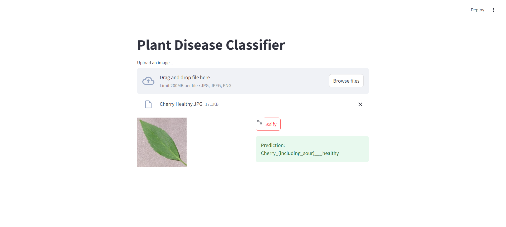

# Plant-Disease-Prediction-using-CNN
Plant Disease Prediction using CNN

So here we will look at Plant Disease Prediction using CNN
Then we will create a web app where we can upload a new image and our model will tell us what disease does the plant have. 

If you want to replicate this model on your local machine please do not rename any files because if you do it wont work. 

Here in the trained_model inside app folder you will upload the h5 model that you will save from your notebook once you are done building your model in google colab. 
Right now cant upload the model cause the file is huge (250mb)

Our model predicts what disease the plants have correctly 95% of the time which is good. Below you can see how you can upload an image and our model makes prediction. 

To run the program in pycharm go to it's Terminal and run using this :- streamlit run app/main.py

After completion your website should look like this :- 

